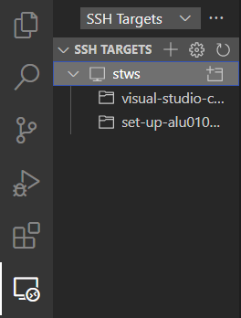
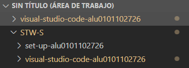
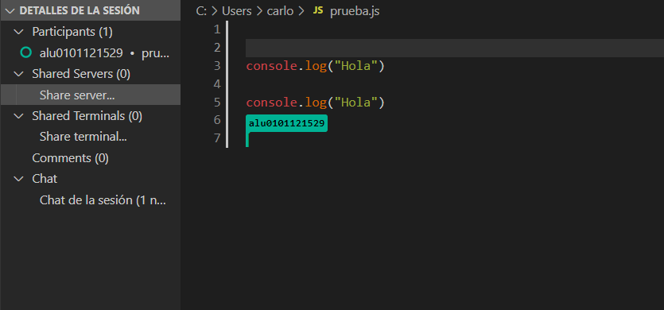
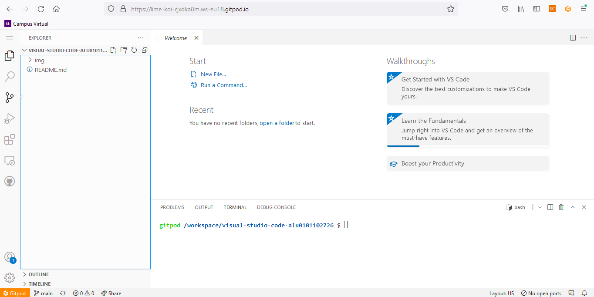

<br />
<p align="center">

  <h3 align="center">README PRÁCTICA - Setup </h3>

  <p align="center">
    Instalando extensiones vscode que usaremos
    <br />
    <a href="https://github.com/ULL-MII-SYTWS-2122/visual-studio-code-alu0101102726"><strong>Docs »</strong></a>
    <br />
    <br />
    <a href="https://github.com/ULL-MII-SYTWS-2122/visual-studio-code-alu0101102726/issues">Report bug</a>
    ·
    <a href="https://github.com/ULL-MII-SYTWS-2122/visual-studio-code-alu0101102726/issues">Request Feature</a>
  </p>
</p>

<!-- TABLE OF CONTENTS -->
<details open="open">
  <summary>Table of Contents</summary>
  <ol>
    <li><a href="#remote-ssh">Remote SSH</a></li>
    <li>
      <a href="#multi-root-workspaces">Multi-root Workspaces</a>
    </li>
    <li><a href="#live-share">Live Share</a></li>
    <li><a href="#gitpod">Gitpod</a></li>
  </ol>
</details>

## Remote SSH
Esta herramienta es la que se ha instalado en primer lugar para poder trabajar en la máquina virtual del iaas. Para ello se instaló la extensión y además se hizo una configuración rápida en el fichero _ssh/config_ definiendo algunos parámetros como nombre del host, ip y usuario:
```h
Host stws
    HostName 10.6.130.31
    User usuario
```

Ya con esto definido, en la extensión que habíamos instalado se puede ver como se encuentra nuestra máquina, además de verse las carpetas a las que se ha accedido recientemente en la misma:



***
## Multi-root Workspaces
Puede trabajar con varias carpetas de proyectos en Visual Studio Code con espacios de trabajo de múltiples raíces. Esto puede ser útil cuando está trabajando en varios proyectos relacionados al mismo tiempo. Para ver estp reflejado se ha creado un área de trabajo que consta de las prácticas de la asignatura, tienendo lo siguiente:



***
## Live Share
Con esta herramienta se va a poder editar de forma simultánea con varios compañeros. Esto se puede extender hasta que las diferentes personas estén trabajando en un mismo proyecto pero en archivos diferentes de forma simultánea. Para ver como funciona, aquí se deja una captura:



***
## Gitpod
Gitpod es una plataforma de código abierto para entornos de desarrollo automatizados y listos para codificar que se integra en su flujo de trabajo existente. Permite a los desarrolladores describir su entorno de desarrollo como código e iniciar entornos de desarrollo nuevos e instantáneos para cada nueva tarea directamente desde su navegador.

Lo primero que se hizo fue instalar el plugin de firefox para poder usarlo en el navegador, después se le dieron los permisos para acceder a los repositorios de github. Cuando todo esto estaba hecho se obtuvo lo siguiente:



Además de todo lo comentado, también se hizo una lectura de cmo funciona la herramienta, sobre todo enfocada en los primeros pasos, donde se enseña a crear un proyecto, crear el archivo _gitpod.yml_, etc.
